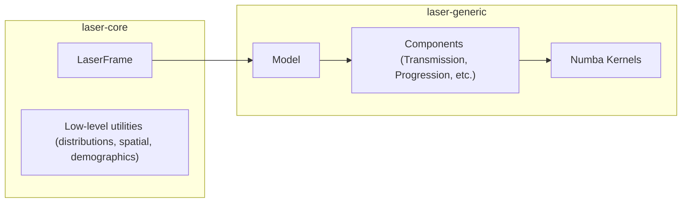
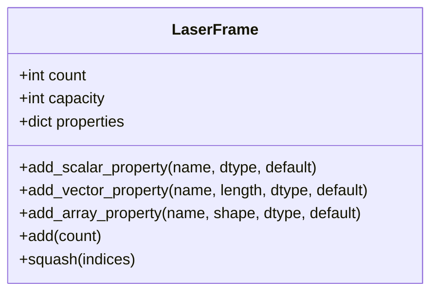
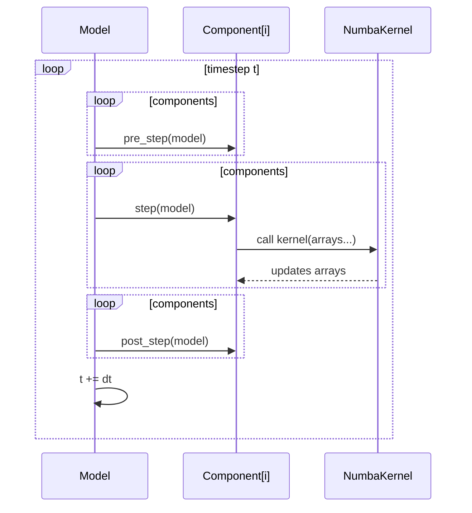
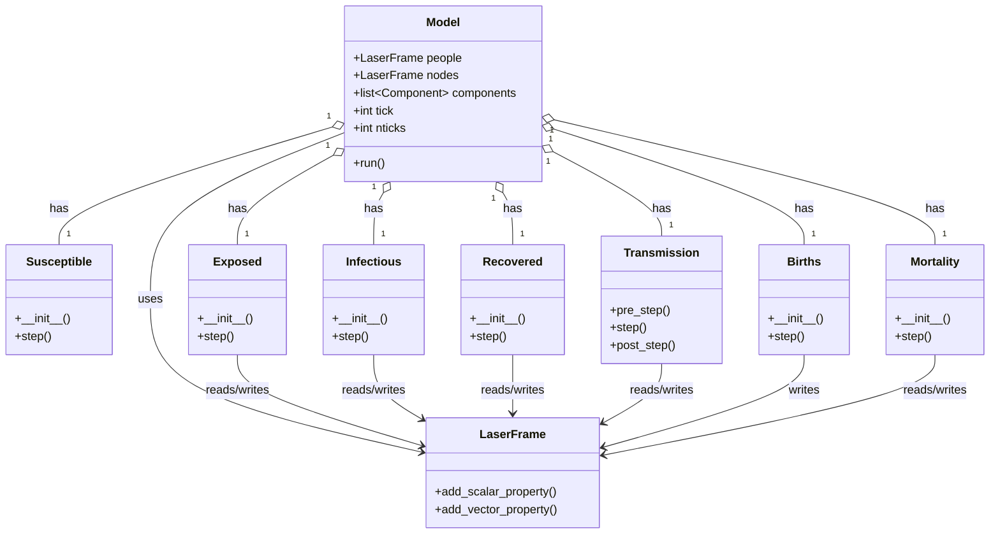

# **LASER Architecture Overview**

*Architecture of `laser-core` and `laser-generic` packages*

## **1. Purpose**

This document describes the **structural architecture** and **core responsibilities** of:

* **`laser-core`** — low-level data and memory structures used to build high-performance disease models.
* **`laser-generic`** — a library of modular, composable components implementing generic disease transmission models such as SI, SIR, SIRS, SEIR, and SEIRS.

This document intentionally excludes details of:

* Statistical distributions
* Spatial connectivity kernels
* Demographic initialization utilities

Those are documented separately.

----

# **2. High-Level System Structure**

At a high level:

* `laser-core` provides the **data substrate** (memory, properties, layout).
* `laser-generic` provides the **simulation model**, **components**, and **execution loop**.



The architecture is designed so that:

* **`laser-core` knows nothing about disease modeling**, and
* **`laser-generic` relies heavily on the memory layout & speed** provided by `laser-core`.

----

# **3. `laser-core` Architecture**

## **3.1 Responsibilities**

`laser-core` is responsible for:

* Managing **efficient, columnar memory layouts** for agent/node properties.
* Providing a **schema-like interface** for defining scalar and vector properties per entity.
* Enabling **parallel execution** by keeping values contiguous and Numba-friendly.
* Supporting dynamic population changes (primarily births and, optionally, resizing).

## **3.2 `LaserFrame`**

`LaserFrame` behaves conceptually like a high-performance `DataFrame` designed for:

* Constant mutation
* Parallel processing
* Zero Python-object overhead

### **Core Concepts**

* Each **row** = one agent or node.
* Each **column** = a property.
* Properties may be:

  * **Scalars** (e.g., age, state)
  * **Fixed-length vectors** (e.g., per-tick recording of S/E/I/R counts for nodes)

### **Key Responsibilities**

* Allocate and manage contiguous memory for each property.
* Provide direct access to underlying NumPy arrays.
* Ensure layout is friendly to Numba kernels and multicore CPUs.
* Resize automatically when agents are added.

### **Class Diagram**



----

# **4. `laser-generic` Architecture**

## **4.1 Responsibilities**

`laser-generic` provides:

* A **Model** container orchestrating simulation flow.
* A library of **components** representing distinct parts of a disease process (e.g., transmission, incubation, recovery).
* A **component execution pipeline** ([optional pre-step validation] → step → [optional post-step validation]).
* Integration with **Numba kernels** for high-performance agent updates.

## **4.2 The `Model` Class**

The `Model` object is the conductor of the simulation orchestra:

* Holds one or more **LaserFrames**.
* Holds a list of **components**.
* Maintains simulation time (`tick`).
* Defines the **run loop**, calling component hooks in sequence.

### **Simulation Loop (Conceptual)**

```python
for tick in range(nticks):
    for component in components:
        if validating:
            component.pre_step(model)
        component.step(model)   # usually calls a Numba kernel
        if validating:
            component.post_step(model)
```

This consistent execution order ensures deterministic progression, assuming your random number draws are deterministic as well. The `laser.generic.random` module provides PRNG seeding across NumPy, Numba, and SciPy to help with deterministic random number draws. Note, though, that while Numba generally _does_ provide repeatable random number sequences, it does not guarantee this behavior.

----

## **4.3 Component Architecture**

Components represent **modular behaviors**. Examples:

* Transmission
* Incubation
* Infectious progression
* Recovery
* Births / deaths
* Vaccinations

### **Component Responsibilities**

* Own and manage their own model-specific properties.
* Implement a `step(self, tick)` method containing the core dynamics.
* Optionally implement:

  * `pre_step(self, tick)`
  * `post_step(self, tick)`
  * `on_birth(self, tick, newborn_indices)`
  * `plot(self)`

### **Component Interface**

```python
class BaseComponent:
    def pre_step(self, tick): pass
    def step(self, tick): raise NotImplementedError
    def post_step(self, tick): pass
    def on_birth(self, tick, newborn_indices): pass
    def plot(self): pass
```

### **Kernel Delegation**

The `step()` method typically:

1. Extracts needed properties from the `LaserFrame`.
2. Passes them to a Numba kernel.
3. Lets the kernel perform parallel updates.

----

# **5. Execution Flow Diagram**



----

# **6. SEIR Model: Detailed Class Diagram**

Below is a detailed wiring diagram for a **generic SEIR model** using `laser-generic` components. This example uses:

* `Susceptible` component
* `Exposed` component (E → I)
* `Infectious` component (I → R)
* `Recovered` component (terminal state or may loop back via waning in SIRS or SEIRS)
* `Transmission` component
* `Births` component (optional)
* `Mortality` component (optional)

(You may have bells, whistles, or mutations, but this is the canonical SEIR template.)

## **Component Wiring Diagram**



### **Property Flow (Narrative)**

* **Susceptible**

  * Adds: `nodeid` and `state` properties to `model.people`, `S` property to `model.nodes`
  * Reads: none
  * Writes: none

* **Exposed**

  * Adds: `etimer` property to `model.people`, `E` and `newly_infectious` properties to `model.nodes`
  * Reads: `state`, `etimer`
  * Writes: `state` (E → I)

* **Infectious**

  * Adds: `itimer` property to `model.people`, `I` and `newly_recovered` properties to `model.nodes`
  * Reads: `state`, `itimer`
  * Writes: `state` (I → R)

* **Recovered**

  * Adds: `R` property to `model.nodes`
  * Reads: `state`
  * Writes: nothing unless waning immunity exists (in SIRS or SEIRS)

* **Transmission**

  * Adds: `forces` and `newly_infected` properties to `model.nodes`
  * Reads: `state`
  * Writes: `state` (S → E), sets incubation durations

* **Births**

  * Adds: `births` to `model.nodes` and optionally `dob` to `model.people`
  * Reads: nothing
  * Writes: optionally `dob`, adds agents, triggers `on_birth()` on relevant components

* **Mortality**

  * Adds: `deaths` to `model.nodes`
  * Reads: possibly `dob` (date of birth), survival-related properties
  * Writes: `dod` (date of death), `state`

----

# **7. Extensibility Structure**

The architecture supports extension in three directions:

### **7.1 Adding New Properties**

Add new per-agent or per-node attributes by modifying the `LaserFrame` schema.

### **7.2 Adding New Components**

Implement a new class conforming to the Component interface.

### **7.3 Creating Custom Models**

Compose components into a `Model` in the correct execution order.

----

# **8. Summary**

This architectural split provides:

* **Modularity** — Components rely only on `LaserFrame` and Model lifecycle hooks.
* **Performance** — Data is laid out explicitly for multicore, Numba-driven kernels.
* **Flexibility** — New models and components can be composed without touching core infrastructure.
* **Stability** — `laser-core` provides a durable, minimal foundation; `laser-generic` builds everything else on top.
